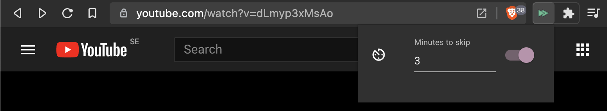

<h1>
	&nbsp;&nbsp;mkeys
</h1>

Browser extension to enable time based skips in YouTube videos using the 
_next-track_ and _previous-track_ media keys.



## Installation

### Chromium

Install all dependencies and build the project with

```bash
# (chromium)
yarn && yarn release 

# or...
yarn && yarn firefox
```

Upon success, the files for the extension will reside under `./dist/`. 
To install the extension in a Chromium based browser go to 
`chrome://extensions`, enable _Developer mode_, click _Load unpacked_ and 
choose the `dist` folder. For Firefox, go to `about:debugging` and choose 
`dist/manifest.json` from the *Load temporary add-on* option. 

## Development

To debug the extension during development, open `package.json` and modify the 
values for `--chromium-binary` and `--chromium-profile` inside the `debug` 
task in accordance with your environment. Next run

```bash
yarn watch
```

to automatically rebuild the project whenever changes to the source files 
are detected and invoke

```bash
yarn debug
```

in another terminal. This will launch a browser with the extension 
pre-installed and upon a new build from Webpack, the extension will be 
automatically re-installed.

## Notes

The extension does not maintain separate states if there are several YouTube 
tabs, i.e. if the extension is disabled in one tab it will be disabled 
everywhere. Changes to the 'enabled' state and the numeric timeskip value send 
a signal to every tab instead of just affecting the active tab 
(see the `handle*` methods in `./src/components/App.tsx` for more details).

The project uses [manifest version 3](https://developer.chrome.com/docs/extensions/mv3/intro/mv3-overview/) 
by default but Firefox requires version 2 (which is also available).
